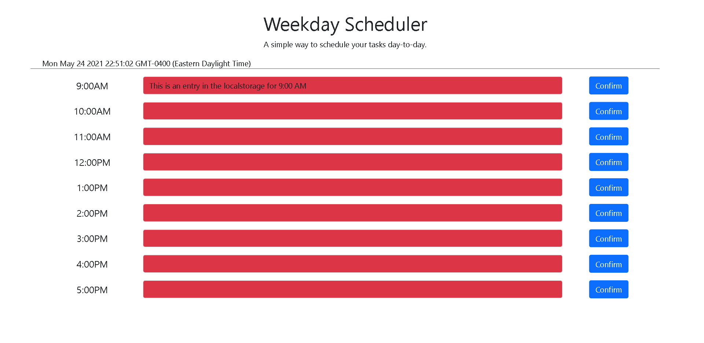

# Workday Scheduler App

### [Page Link](https://b00000001.github.io/workday-scheduler/)

## Usage

- This app is intended to be a simple calendar application that allows a user to save events for each hour.
- This app uses the Moment.js library to work with date and time.

### Color Coding

_Time is shown as color coded shades in the input fields_

- Red is Past
- Grey is current
- Green is future

